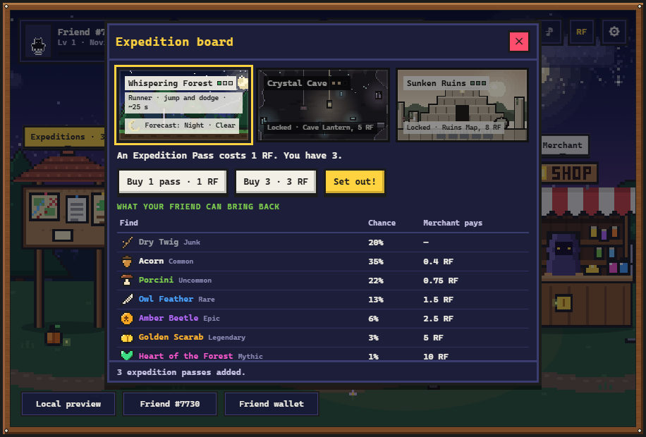
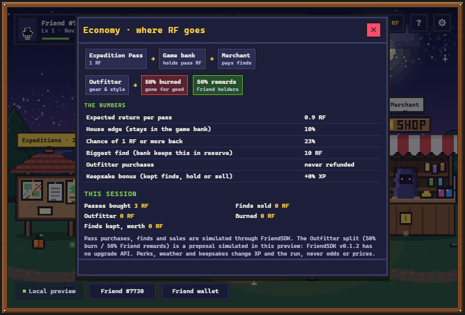
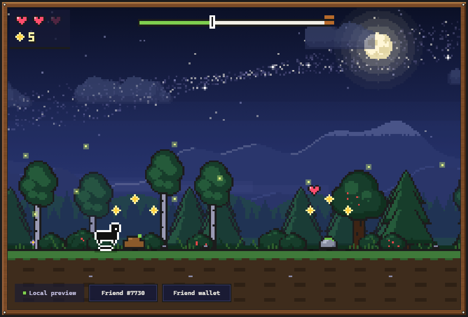
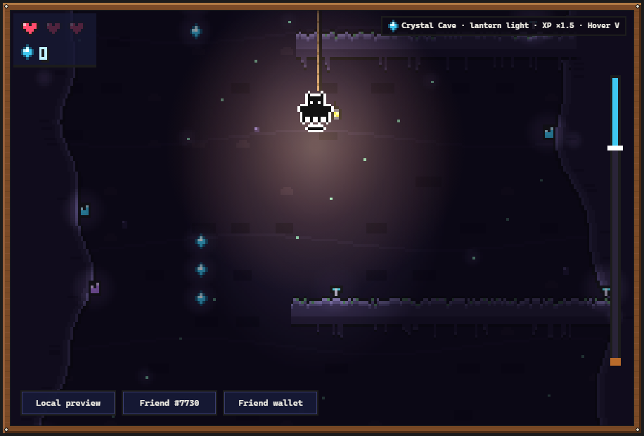
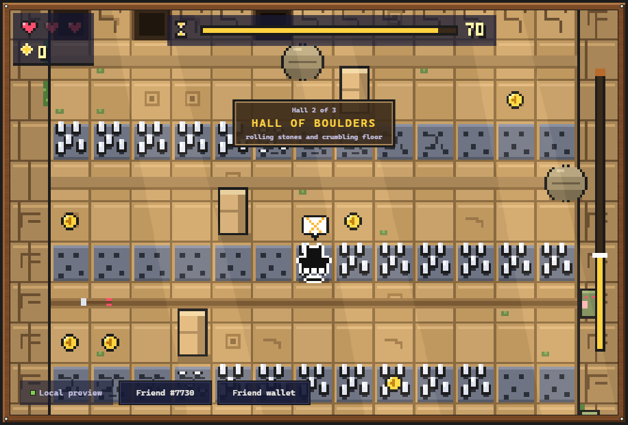
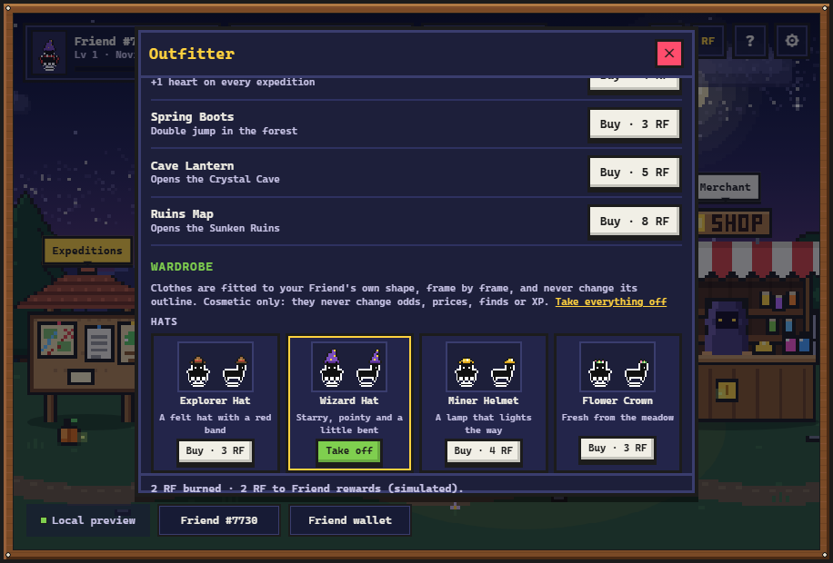
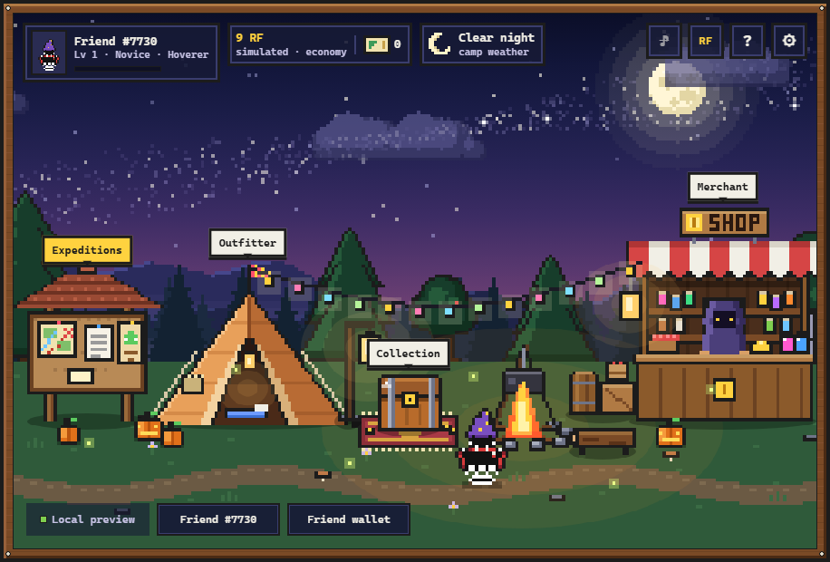
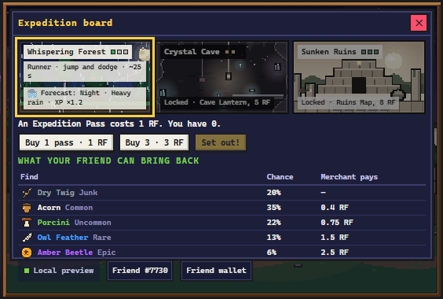

# Rare Friends: Expeditions

Send your Rare Friend from a cozy night camp on short expeditions: a forest runner, a dark cave descent and a trap-filled ruins maze.
Every expedition costs one Expedition Pass (1 RF) and ends at a chest with a find that you keep
or sell back for RF. Kept finds add XP to every expedition (hold or redeem), and an outfitter sells gear,
trails and an 11-piece wardrobe fitted to your own Friend as a pure RF sink (50% burn / 50% rewards).

**Play the preview:** https://dedq3e.github.io/rare-friends-expeditions/
(needs a browser wallet on Robinhood mainnet, chain 4663, holding a hardwired Rare Friends Generations NFT, generation ≥ 1)

On a phone, open the link in your wallet app's built-in browser (MetaMask → Browser, Trust Wallet → Browser) and hold the phone sideways.

| | | |
|---|---|---|
|  |  |  |
|  |  |  |
|  |  | |

On a phone held sideways the panels switch to a compact layout:



Economy design, simulations and the roadmap: [submission/README.md](submission/README.md#economy-design).

Built with **FriendSDK v0.1.2** for the Rare Friends Vibeathon (September 2026).
All balances, purchases, finds and sales are **simulated**.

## Run locally

Node.js 22 or newer is required (FriendSDK's minimum). The commands are the same on every platform:

```sh
git clone https://github.com/DEDQ3E/rare-friends-expeditions.git
cd rare-friends-expeditions
npm install
npm run dev        # http://localhost:4173
```

`npm run dev` and the built preview keep the real ownership gate, so the browser needs a wallet extension
(see above). The automated tests below use the SDK's mock wallet instead.

### Linux

FriendSDK's officially supported platform. Install Node.js 22+ (for example with `nvm install 22`) and Git,
then run the commands above. For the browser tests, `npx playwright install --with-deps chromium` also
installs the system libraries Chromium needs.

### Windows with WSL2

The way FriendSDK recommends on Windows:

1. In PowerShell as administrator: `wsl --install -d Ubuntu`, then restart the computer.
2. In the Ubuntu terminal: install Node.js 22+ (for example with `nvm install 22`) and Git.
3. Clone the repository inside the Linux file system (for example `~/rare-friends-expeditions`), not under
   `/mnt/c`: file watching and installs are much faster there.
4. Run the commands above and open `http://localhost:4173` in your Windows browser with the wallet
   extension (WSL2 forwards `localhost` to Windows).

### Windows (native)

Not officially supported by FriendSDK, but verified for this project on Windows 11 with Node.js 24:
`npm install`, `npm run build` and every check below pass in PowerShell or Git Bash. Install Node.js LTS from
[nodejs.org](https://nodejs.org). npm may warn that esbuild's install script is not approved; the build
still works.

### Windows without Node

Double-click `play.bat`. It serves the prebuilt `docs/` folder on `http://localhost:4173` with the
PowerShell built into Windows, so nothing needs to be installed.

## Checks

```sh
npm run typecheck                       # TypeScript
npm run check                           # friendsdk game + economy validation
npm install -D playwright && npx playwright install chromium
npm test                                # SDK browser smoke test (mock wallet)
npm run playthrough                     # buy → expedition → chest → sell → outfitter → collection
npm run mobile                          # phone sizes: camp and every panel; sideways, a run per place (chest, banner hides)
npm run economy                         # exact odds over 10,000 rolls, EV, keepsakes, published tables
npm run wardrobe                        # every clothing piece fitted on 10 body types, fit sheet PNG
npm run sessions                        # exact session statistics behind the submission's table
npm run build                           # static build into docs/ (GitHub Pages)
```

## Layout

| Path | What |
| --- | --- |
| `games/expeditions/index.tsx` | Game component: camp UI, panels, SDK actions |
| `games/expeditions/engine.ts` | Canvas engine (240×160, pixel-scaled): camp, forest runner, hosts the cave and ruins scenes |
| `games/expeditions/cave.ts`, `ruins.ts` | Crystal Cave rope descent and Sunken Ruins trap gauntlet |
| `games/expeditions/audio.ts` | Music, ambience and effects synthesized with Web Audio |
| `games/expeditions/art.ts` | Pixel art drawn in code: Friend sprite, scenery, finds, trails |
| `games/expeditions/game.json` | Economy: pass price, outcome weights, merchant prices |
| `games/expeditions/keepsakes.ts` | Keepsake bonus for kept finds (hold or redeem) |
| `games/expeditions/wardrobe.ts`, `fit.ts` | Clothes fitted to each Friend's own silhouette, frame by frame |
| `scripts/sessions.mjs` | Exact distribution of pass sessions (no sampling) |
| `games/expeditions/README.md` | Controls, exact rules and economy |
| `docs/` | Static build served by GitHub Pages |
| `tests/` | Economy, wardrobe fit, playthrough, container compliance, phone layout and README screenshot scripts |
| `media/` | Screenshots used in the READMEs (`node tests/media.mjs media`) |

Game rules and the full economy table: [games/expeditions/README.md](games/expeditions/README.md).

## License and credits

Code: Apache-2.0. The Friend character uses canonical Rare Friends Generations sprites and the SDK
sound kit, used under the FriendSDK [NOTICE](https://github.com/spokesz/friendsdk/blob/main/NOTICE.md).
All other artwork (camp, forest, cave, ruins, finds, chest, clothes, UI) was drawn in code for this project.
