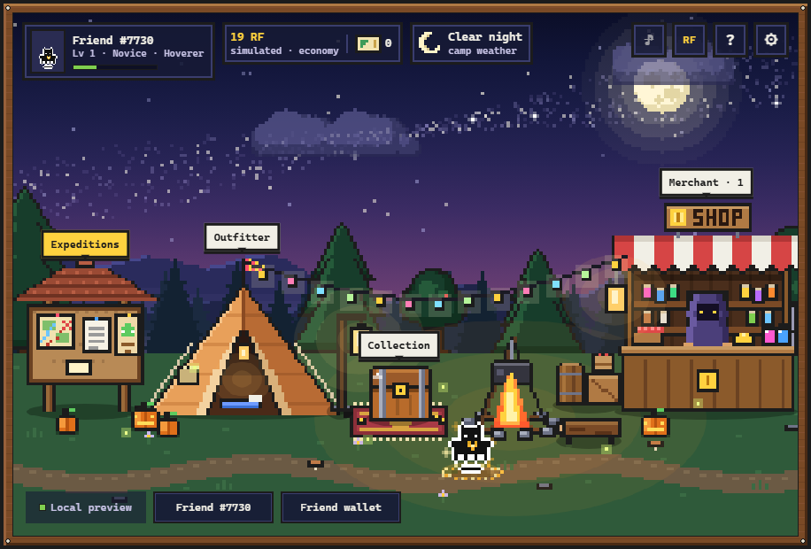
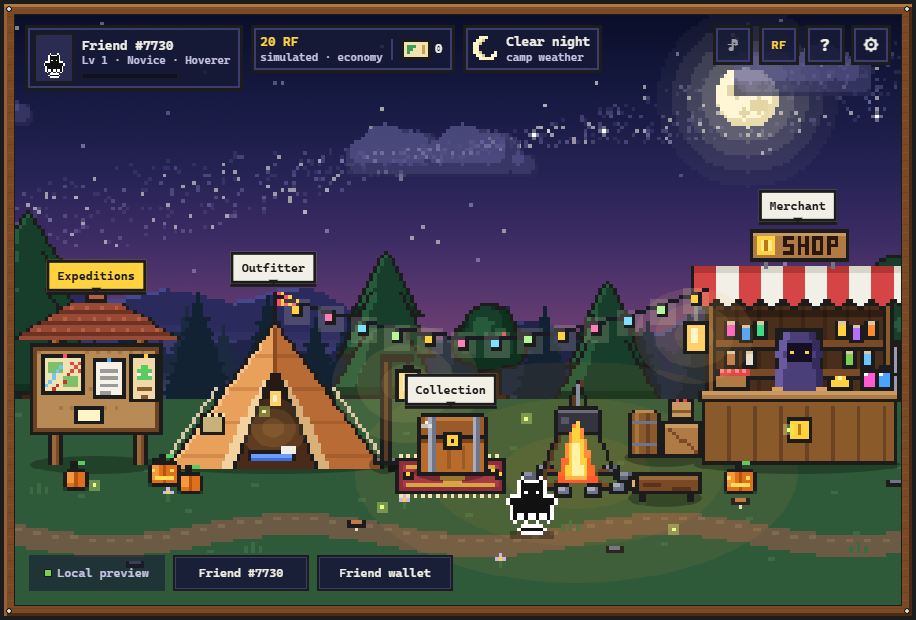
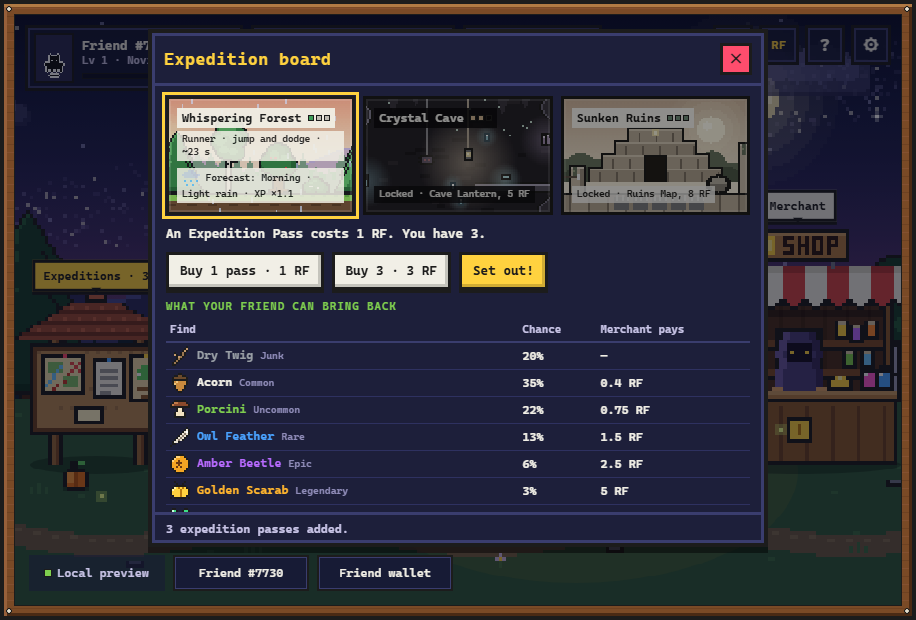
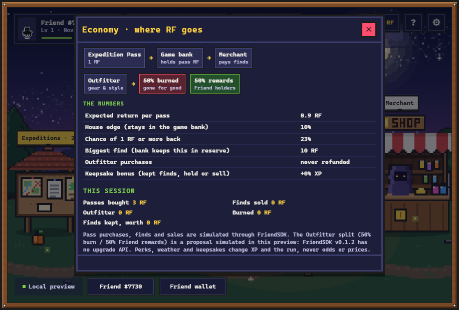
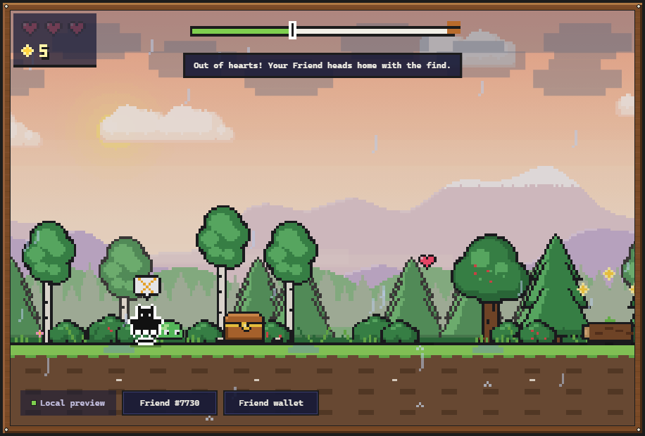
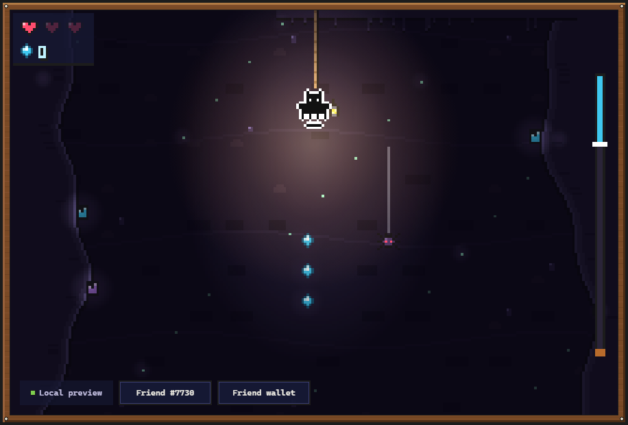
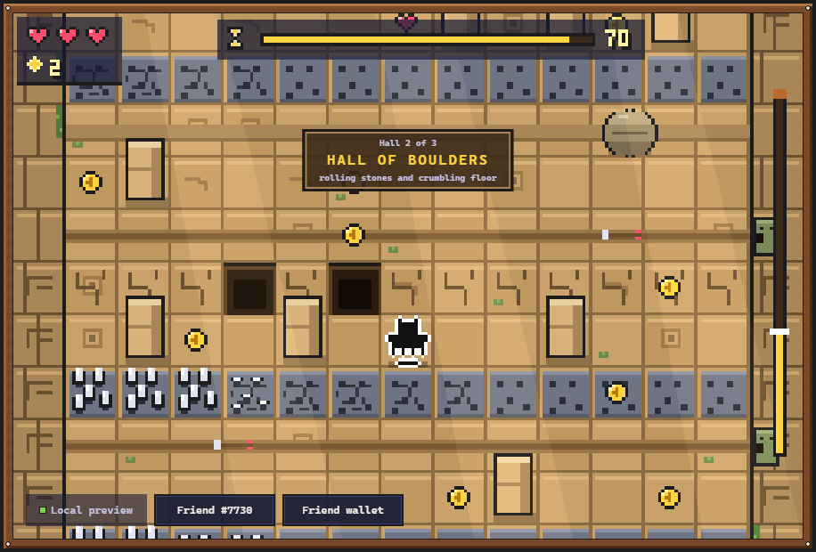
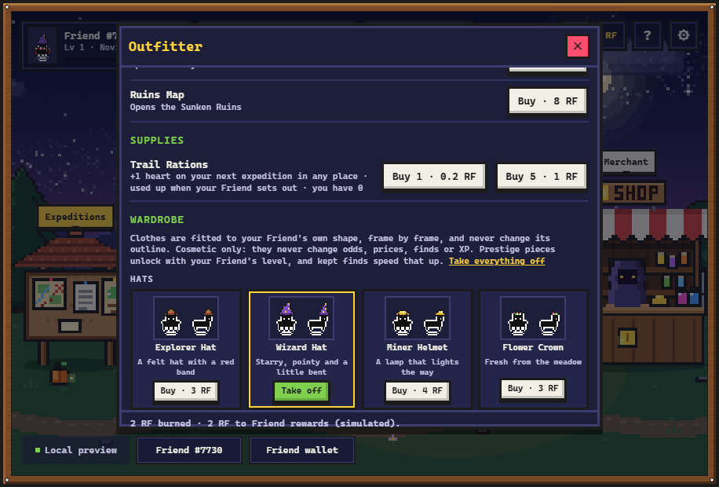
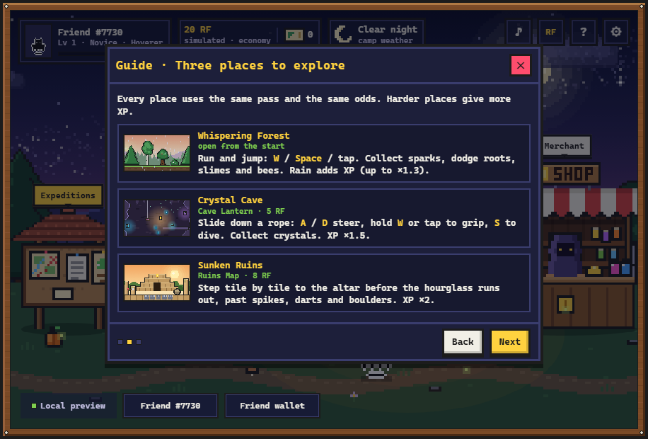
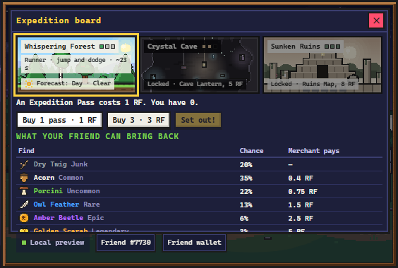

# Rare Friends: Expeditions

Send your Rare Friend from a cozy night camp on short expeditions: a forest runner, a dark cave descent and a trap-filled ruins maze.
Every expedition costs one Expedition Pass (1 RF) and ends at a chest with a find that you keep
or sell back for RF. Kept finds add XP to every expedition (hold or redeem), and from Rare up your Friend wears a
trophy for them (Feather Pin, Amber Amulet, Scarab Brooch, Heart Pendant) until you sell. An outfitter sells gear,
trails, Trail Rations and a 13-piece wardrobe fitted to your own Friend (two pieces unlock with the Friend's level)
as a pure RF sink (50% burn / 50% rewards).



**Play the preview:** https://dedq3e.github.io/rare-friends-expeditions/
(needs a browser wallet on Robinhood mainnet, chain 4663, holding a hardwired Rare Friends Generations NFT, generation ≥ 1)

**Gameplay video with sound (59 s):** the camp, the Whispering Forest, the Crystal Cave and the Sunken Ruins
([MP4 file](https://dedq3e.github.io/rare-friends-expeditions/demo.mp4)):

https://github.com/user-attachments/assets/95c689d1-fd6c-438c-8f66-f6f8ad552ca0

On a phone, open the link in your wallet app's built-in browser (MetaMask → Browser, Trust Wallet → Browser) and hold the phone sideways.

| | | |
|---|---|---|
|  |  |  |
|  |  |  |
|  |  |  |
|  | | |

The rarest kept find lights a **keepsake glow** under your Friend (none, Rare, Epic, Legendary, Mythic):


On a phone held sideways the panels switch to a compact layout:



## Economy

**Hold or redeem.** Every find is backed by the game bank at its fixed Merchant price, with no expiry. Kept, it adds
XP to every expedition (rarer finds give more bonus per RF held), lights a glow under the Friend and, from Rare up,
is worn as a **trophy** on its chest: the Feather Pin (Rare), Amber Amulet (Epic), Scarab Brooch (Legendary) or
Heart Pendant (Mythic). Trophies are never sold; selling the last find of a rarity takes its trophy off, and the
Merchant's button says so ("Selling removes your Scarab Brooch").

**Built on the Ethergoo hold-or-redeem pattern — what Expeditions adds.** The pass loop follows the pattern of Ethergoo, the organizers' example submission ([spokesz/rarefriends-vibeathon#4](https://github.com/spokesz/rarefriends-vibeathon/pull/4)): a 1 RF chance item turns into a collectible with a fixed, fully backed RF redemption value, productive while held (there a goo production bonus, here an XP bonus), with more bonus per RF for rarer items. Expeditions builds on that base:

| Added in Expeditions | What it does | Why it matters for RF |
|---|---|---|
| Skill runs | Every pass is a real run in one of three mini-games (forest runner, cave descent, ruins gauntlet); skill earns XP, never better odds | Play value in every pass, while the contract alone decides the find |
| Trophies | Rare to Mythic finds are worn on the Friend's chest while kept; never sold | A visible reason to hold, and a reason to pay above the floor (see "Trading finds") |
| XP → items from a level | Keepsakes speed up XP; the Star Cloak (6 RF) opens at Lv 4, the Golden Crown (8 RF) at Lv 6 | Holding and playing well turn into demand for RF |
| Outfitter 50 / 50 | Gear, clothes, trails and Trail Rations; never refunded, never change odds; 50% burned, 50% to Friend rewards (proposal) | A pure sink: with half the edge, 7–10% of all RF spent in the game is burned |
| Seasons | Harvest Season items sold only until Nov 30; a new limited item every season (roadmap) | Recurring, time-limited demand |
| Floor price when trading | The Merchant's fixed price is a hard floor for traded finds; 5% fee, 2.5% burned (roadmap) | Finds cannot trade below their backing; trading burns RF too |

**Trading finds (roadmap, not in this MVP).** Finds are ERC-1155 rewards in the Friend's wallet, so they can be listed against $RAREFRIENDS. The Merchant price is a hard floor: anyone can redeem a find for its fixed RF at any time, backed by the stake, so the price cannot stay under it. Above the floor a find is worth its RF plus its keepsake bonus and its trophy. The trophy is the part of that premium RF cannot buy anywhere else: a Legendary find is the only way to wear the Scarab Brooch, a Mythic the only way to wear the Heart Pendant, so a player who wants one pays above the floor, while the floor stays backed. Proposed trade fee 5%: 2.5% burned, 2.5% to the game bank and Friend rewards.

**30 days, day by day** (`npm run model`, checked by `npm run economy`): the three player scenarios and three stress
tests against the game bank with the SDK contract's reserve rules, starting from 10,000 RF of builder funding.
Player behaviour is an assumption, listed in [submission/README.md](submission/README.md#how-rf-is-spent-and-the-economy):

| 30 days (10,000 RF funding) | Passes played | Passes refused | **Burned** | RF held in kept finds (day 30) | Lowest free stake | Free stake, day 30 | Bank never below zero |
|---|---:|---:|---:|---:|---:|---:|:---:|
| Conservative | 150,000 | 0 | **12,000 RF** | 7,613 RF | 1,000 RF | 17,500 RF | yes |
| Base | 300,000 | 0 | **30,000 RF** | 50,400 RF | 1,000 RF | 25,000 RF | yes |
| Optimistic | 600,000 | 0 | **69,000 RF** | 270,000 RF | 1,000 RF | 40,000 RF | yes |
| Stress: everyone sells every kept find on day 30 | 300,000 | 0 | **30,000 RF** | 0 RF | 1,000 RF | 25,000 RF | yes |
| Stress: nobody ever sells a find | 300,000 | 0 | **30,000 RF** | 270,000 RF | 1,000 RF | 25,000 RF | yes |
| Stress: 10× the players, same 10,000 RF funding | 812,190 | 2,187,810 (73%) | **81,219 RF** | 193,432 RF | 1 RF | 50,610 RF | yes |

Economy design, session statistics, the 1,000-player model, the 30-day model's assumptions and the roadmap:
[submission/README.md](submission/README.md).

Built with **FriendSDK v0.1.4** for the Rare Friends Vibeathon (September 2026).
All balances, purchases, finds and sales are **simulated**, and the RF prices are placeholders that show the
proportions: multiply every RF amount by the same factor to price the game higher, and the odds and percentages stay
the same (details in [submission/README.md](submission/README.md#costs-and-rewards)).

## Run locally

Node.js 22 or newer is required (FriendSDK's minimum). The commands are the same on every platform:

```sh
git clone https://github.com/DEDQ3E/rare-friends-expeditions.git
cd rare-friends-expeditions
npm install
npm run dev        # http://localhost:4173
```

`npm run dev` and the built preview keep the real ownership gate, so the browser needs a wallet extension
(see above). The automated tests below use the SDK's mock wallet instead.

### Linux

FriendSDK's officially supported platform. Install Node.js 22+ (for example with `nvm install 22`) and Git,
then run the commands above. For the browser tests, `npx playwright install --with-deps chromium` also
installs the system libraries Chromium needs.

### Windows with WSL2

The way FriendSDK recommends on Windows:

1. In PowerShell as administrator: `wsl --install -d Ubuntu`, then restart the computer.
2. In the Ubuntu terminal: install Node.js 22+ (for example with `nvm install 22`) and Git.
3. Clone the repository inside the Linux file system (for example `~/rare-friends-expeditions`), not under
   `/mnt/c`: file watching and installs are much faster there.
4. Run the commands above and open `http://localhost:4173` in your Windows browser with the wallet
   extension (WSL2 forwards `localhost` to Windows).

### Windows (native)

Not officially supported by FriendSDK, but verified for this project on Windows 11 with Node.js 24:
`npm install`, `npm run build` and every check below pass in PowerShell or Git Bash. Install Node.js LTS from
[nodejs.org](https://nodejs.org). npm may warn that esbuild's install script is not approved; the build
still works.

### Windows without Node

Double-click `play.bat`. It serves the prebuilt `docs/` folder on `http://localhost:4173` with the
PowerShell built into Windows, so nothing needs to be installed.

## Checks

```sh
npm run typecheck                       # TypeScript
npm run check                           # friendsdk game + economy validation
npm install -D playwright && npx playwright install chromium
npm test                                # SDK browser smoke test (mock wallet)
npm run playthrough                     # guide → buy → expedition → Rare chest → trophy worn → sold, trophy gone → outfitter → cave → ruins
npm run compliance                      # SDK container size and sandbox; no transaction code in docs/
npm run mobile                          # phone sizes: start guide, camp and every panel; sideways, a run per place (chest, banner hides)
npm run economy                         # exact odds over 10,000 rolls, EV, keepsakes, trophies, 30-day model, published tables
npm run wardrobe                        # every clothing piece and trophy fitted on 10 body types, keepsake glow check, sheet PNGs
npm run sessions                        # exact session statistics behind the submission's table
npm run model                           # daily RF flows for 1,000 players, then 30 days day by day with stress tests
npm run build                           # static build into docs/ (GitHub Pages); keeps .nojekyll and the demo video
npm run demo                            # records the 1-minute gameplay video with sound into docs/demo.mp4 (needs Microsoft Edge and npm install --no-save ffmpeg-static)
```

The automated tests use the SDK's mock wallet. Every published build is also played by hand with a real wallet on
Robinhood mainnet holding a Generations NFT, on a computer and on a phone in a wallet browser. The preview never
asks for a transaction, a signature or an RF approval, and with FriendSDK v0.1.4 its bundle contains no wallet
transaction, signing, approval or contract-write calls (`npm run compliance` checks `docs/`).

## Layout

| Path | What |
| --- | --- |
| `games/expeditions/index.tsx` | Game component: camp UI, panels, SDK actions |
| `games/expeditions/engine.ts` | Canvas engine (240×160, pixel-scaled): camp, forest runner, hosts the cave and ruins scenes |
| `games/expeditions/cave.ts`, `ruins.ts` | Crystal Cave rope descent and Sunken Ruins trap gauntlet |
| `games/expeditions/audio.ts` | Music, ambience and effects synthesized with Web Audio |
| `games/expeditions/art.ts` | Pixel art drawn in code: Friend sprite, scenery, finds, trails |
| `games/expeditions/game.json` | Economy: pass price, outcome weights, merchant prices |
| `games/expeditions/keepsakes.ts`, `glow.ts` | Keepsake bonus, glow and trophies for kept finds (hold or redeem) |
| `games/expeditions/wardrobe.ts`, `fit.ts` | Clothes fitted to each Friend's own silhouette, frame by frame |
| `scripts/sessions.mjs` | Exact distribution of pass sessions (no sampling) |
| `scripts/economy-model.mjs` | Daily RF flows for 1,000 players; 30-day bank model with stress tests |
| `games/expeditions/README.md` | Controls, exact rules and economy |
| `docs/` | Static build served by GitHub Pages, plus the gameplay video (`demo.mp4`) |
| `tests/` | Economy, wardrobe fit, playthrough, container compliance, phone layout, README screenshot and demo video scripts |
| `media/` | Screenshots used in the READMEs (`node tests/media.mjs media`, `trophy.png` alone with `node tests/media.mjs media trophy`; `keepsake-glow.png` from `node tests/wardrobe.mjs`) |

Game rules and the full economy table: [games/expeditions/README.md](games/expeditions/README.md).

## License and credits

Code: Apache-2.0. The Friend character uses canonical Rare Friends Generations sprites and the SDK
sound kit, used under the FriendSDK [NOTICE](https://github.com/spokesz/friendsdk/blob/main/NOTICE.md).
All other artwork (camp, forest, cave, ruins, finds, chest, clothes, UI) was drawn in code for this project.
